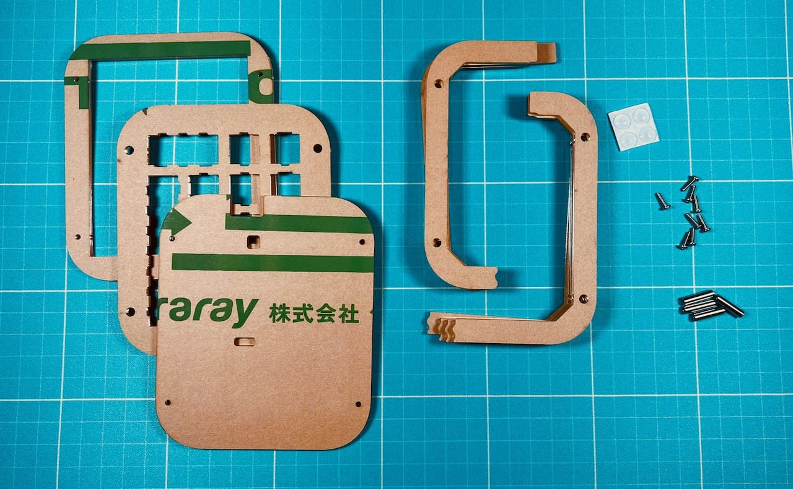
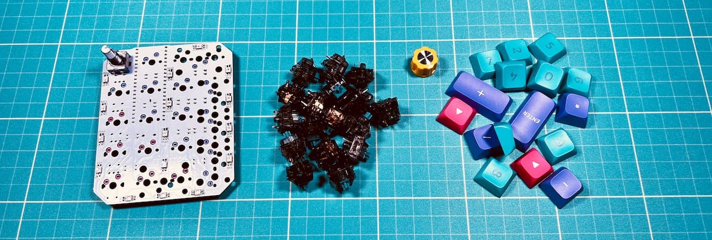
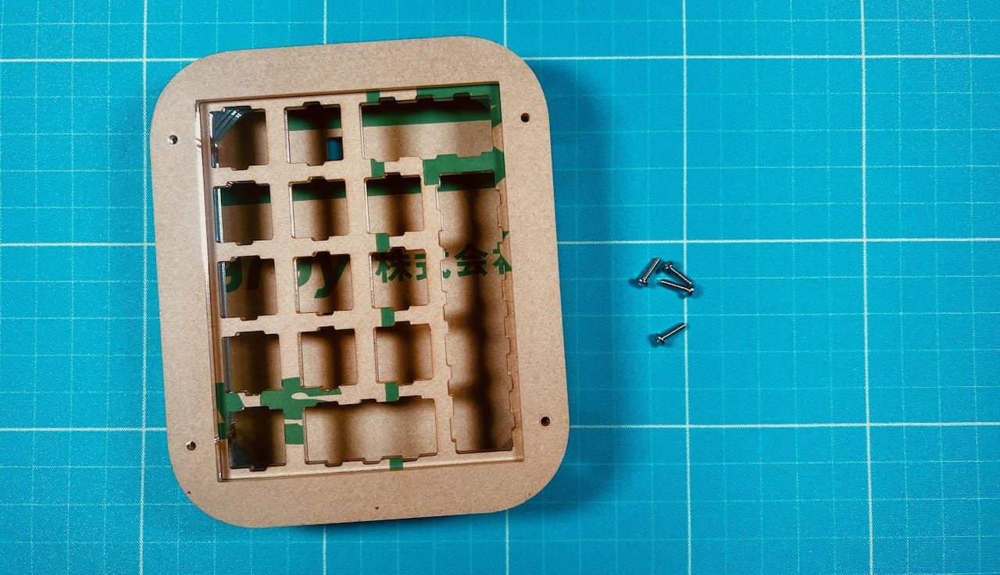
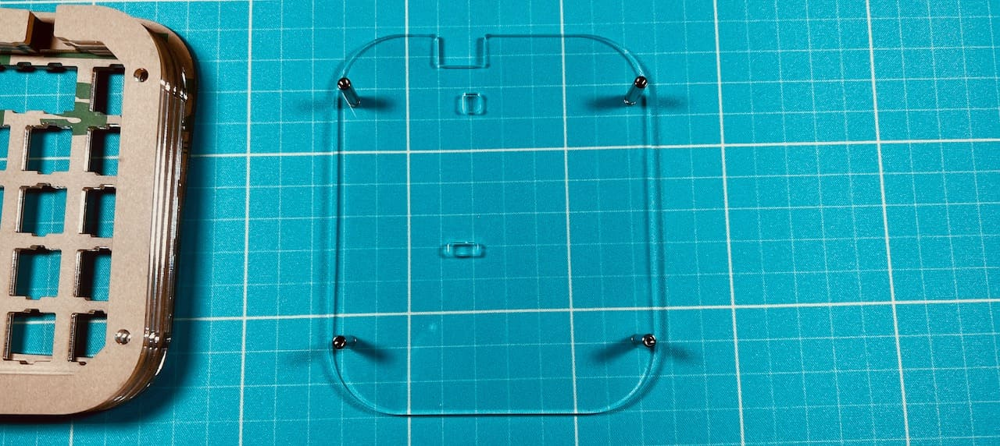
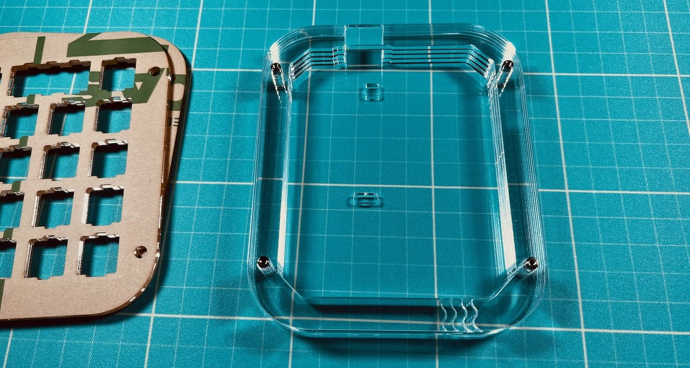
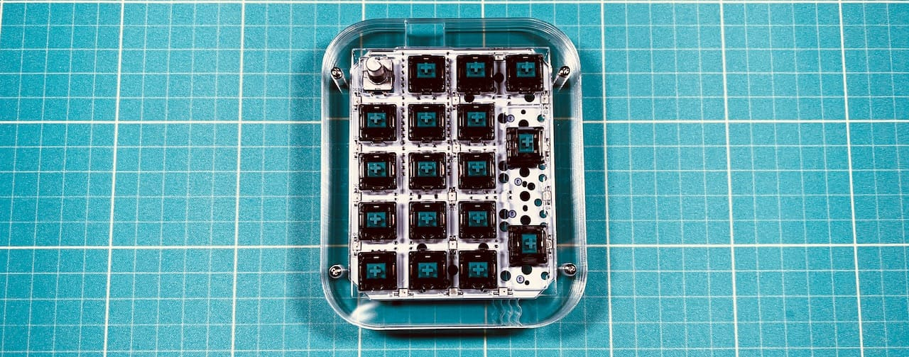
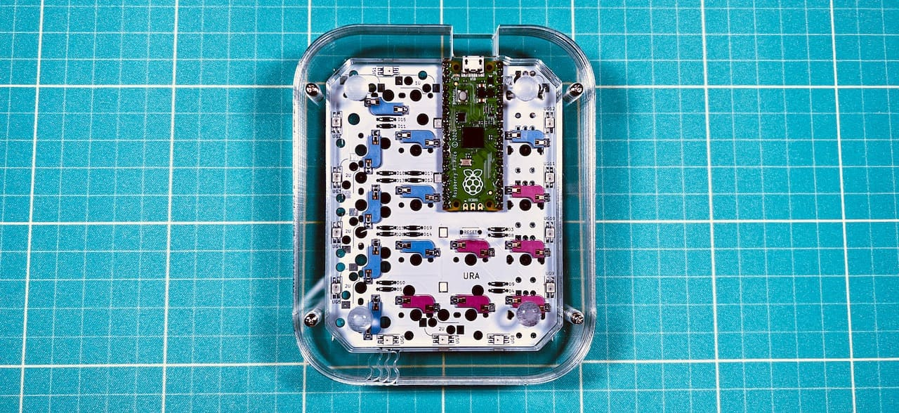

# Shotgun チェリーパイ アクリル積層ケース
- [ご注意](#ご注意)
- [キット内容](#キット内容)
- [組み立て](#組み立て)
- [そのほか](#そのほか)
## ご注意
- 組み立てにはShotgun チェリーパイ（[遊舎工房](https://shop.yushakobo.jp/products/3415?_pos=4&_sid=ba7d98320&_ss=r)、[BOOTH](https://tarohayashi.booth.pm/items/3430753)）が必要です。
- スタビライザーを使用することができません。
- ご自身で発注するとお好きな色のアクリル、ネジで制作可能です。
- キースイッチは5ピンのものがおすすめです。

## キット内容
  
|部品名|数|入手先|
|-|-|-|
|アクリルプレート|[図面データ](data.md)|[遊舎工房](https://shop.yushakobo.jp/collections/services/products/lasercut)、[工房Emerge+](emergeplus.jp)等|
|4x15mmスペーサー|4|[遊舎工房](https://shop.yushakobo.jp/products/a0800c2?_pos=1&_sid=19dbc8a58&_ss=r&variant=37665435484321)、[ヒロスギネット](https://www.hirosugi-net.co.jp/shop/g/g2404/)|
|8mmM2ネジ|8|[遊舎工房](https://shop.yushakobo.jp/products/a0800n2?_pos=2&_sid=6d67644cd&_ss=r&variant=37665433026721)、[ヒロスギネット](https://www.hirosugi-net.co.jp/shop/g/g102178/)等|
|ゴム足|4|[遊舎工房](https://shop.yushakobo.jp/collections/all-keyboard-parts/products/a0800ur-01-6?variant=37665431060641)、100円ショップ、Amazon等|

### 必要なもの
  
※詳細は[Shotgun チェリーパイのビルドガイド](https://github.com/Taro-Hayashi/Shotgun-CherryPie/blob/main/README.md)をご覧ください
|部品名|||
|-|-|-|
|はんだ付け済みメインボード|キースイッチ|キーキャップ|

### 工具
|||
|-|-|
|精密ドライバー|プラスドライバー、必須|
|静電防止手袋|組み立て中に指紋が付くのを防げます。|
|アクリサンデー ポリケアF70|指紋を拭いたりホコリを付きにくくできます。|
|アクリサンデー 研磨剤|側面を磨いてツルツルにしたり、細かい傷を消すことができます。|

## 組み立て
※プレートの順番がわからなくなった場合はこちらを参考にしてください。
 - [プレート一覧](plates.md)

キットをご購入の場合は仮組みされています。アクリルを発注した場合も一度ケースとして組み立てられるか確認すると安全でしょう。  
  
表面のネジを外します。  
  
裏返してスペーサーごと底のプレートを抜き取ります。  
  
ネジを外して底のプレートからスペーサーを取り除いたら保護フィルムを剥がし、ふたたびネジでスペーサーを取り付けます。  
  
表裏があるので穴の位置に気をつけてください。  
  
保護フィルムを外しつつプレートを乗せていきます。  
  
  
  
  
スイッチプレートはメインボードとスイッチで挟み込みます。  
  
  
すべてのプレートを乗せたらネジで止めます。  
  
ゴム足を取り付けてキーキャップを取り付けたら完成です。  
  
  

## 販売ページ
- [BOOTH](https://tarohayashi.booth.pm/items/4144494)  

遊舎工房フリーマーケットで余った分をBOOTHで販売予定です。

## ギャラリー
こちらに載せても構わないという方はtwitter等でご連絡ください。プルリクを下さればマージします。
