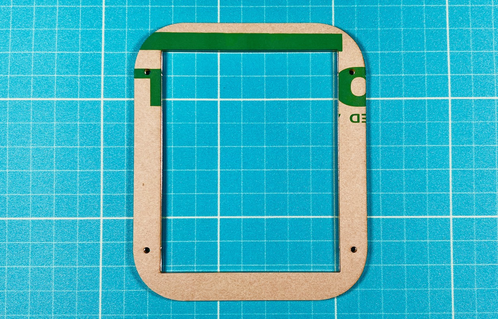
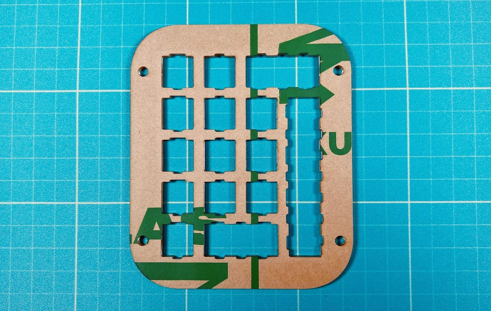
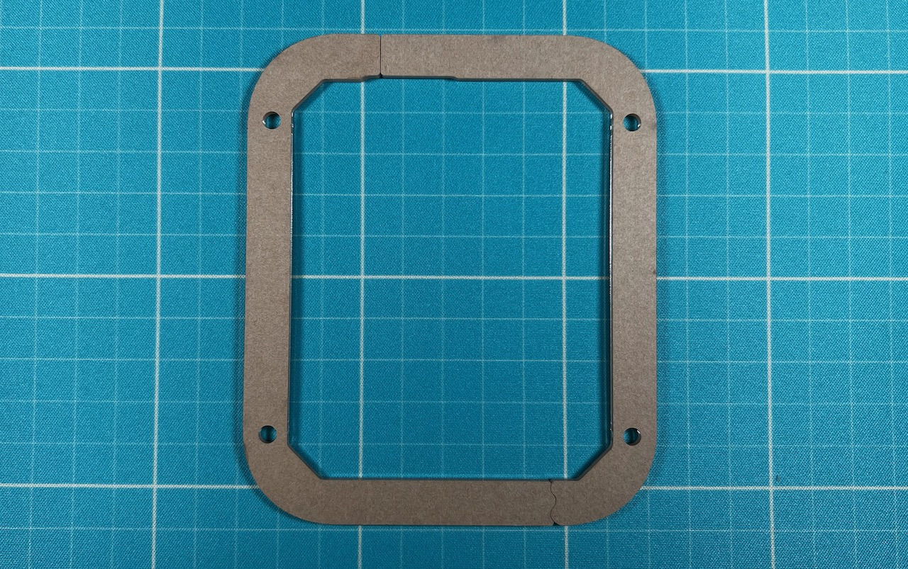
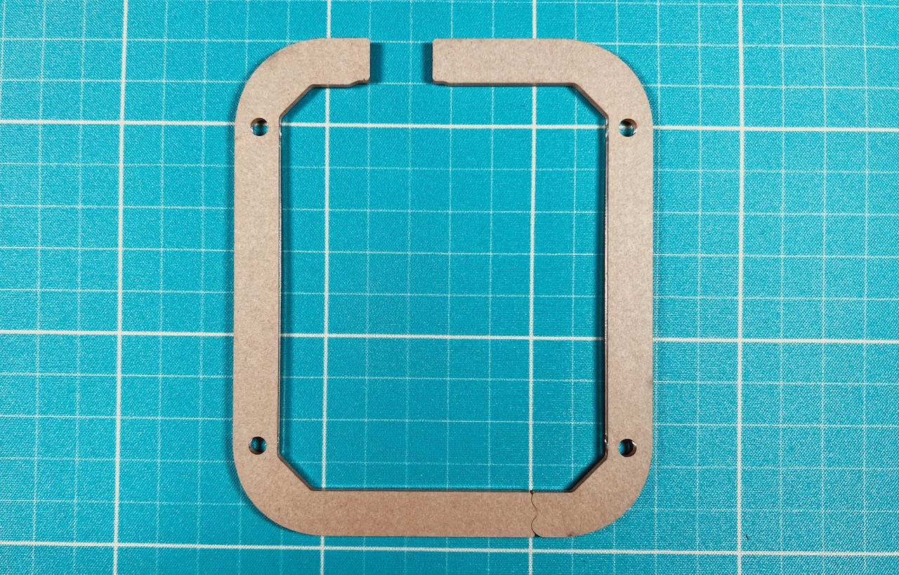
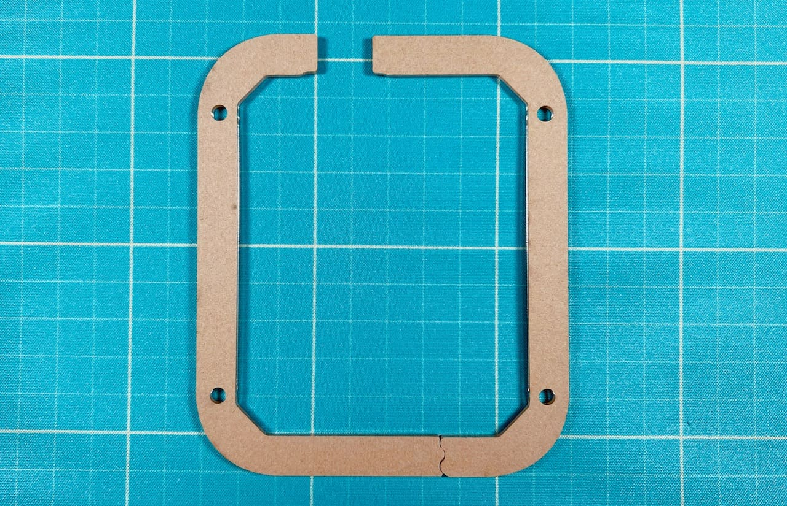
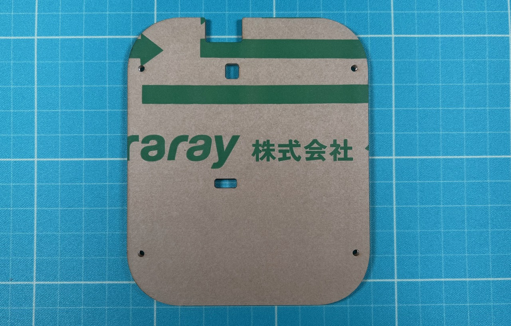

## プレート一覧
上から順です。1層目以外は表裏があります。  
### 1層目
一枚板で長方形に切り抜かれています。  

### 2層目
一枚板でキースイッチの穴が空いています。  

### 3層目
別売りのパステルミドルプレートはこれの代わりに使います。  

### 4層目
4〜6枚目の違いは接合部分の位置です。重ねた時に外形が一致するように組み合わせてください。順不同。  

### 5層目

### 6層目

### 7層目
一枚板でリセットスイッチ用の穴が空いています。  

