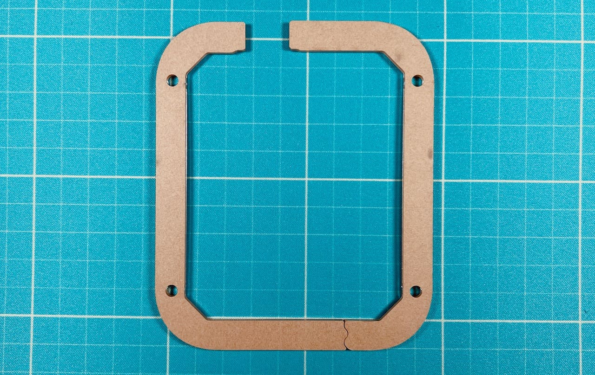

## プレート一覧
上から順です。1枚目以外は表裏があります。
### 1枚目

一枚板で長方形に切り抜かれています。
### 2枚目

一枚板でキースイッチの穴が空いています。
### 3枚目

別売りのパステルミドルプレートはこれの代わりに使います。
### 4枚目

4〜6枚目の違いは接合部分の位置です。重ねた時に外形が一致するように組み合わせてください。順不同。
### 5枚目

### 6枚目

### 7枚目

一枚板でリセットスイッチ用の穴が空いています。
